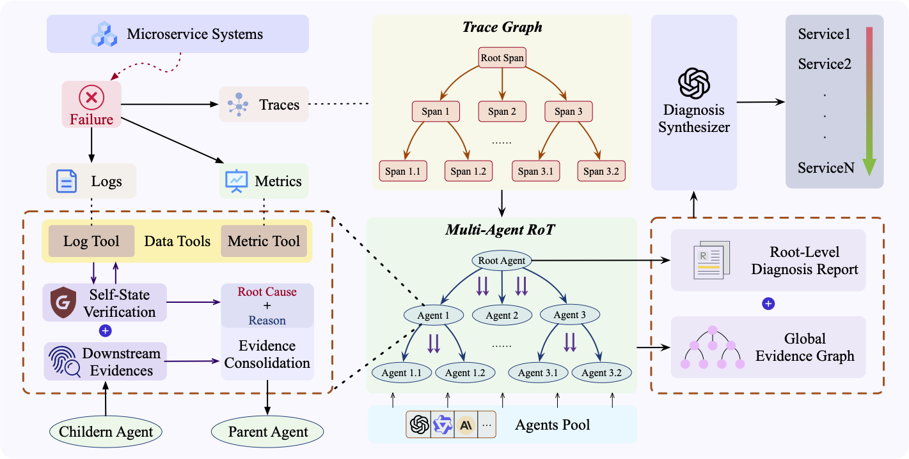

# RCLAgent

> **Paper**: Towards In-Depth Root Cause Localization for Microservices with Multi-Agent Recursion-of-Thought



> RCLAgent is an in-depth root cause localization framework for microservice systems that realizes multi-agent recursion-of-thought with parallel reasoning.
> RCLAgent is motivated by our empirical study of how human SREs conduct root cause analysis in practice, as well as an analysis of why existing LLM-based approaches often fall short.
> By decomposing the diagnostic process along the trace graph, RCLAgent assigns each span to a Dedicated Agent operating within a bounded context, enabling focused and fine-grained analysis while selectively incorporating relevant log and metric evidence. These agents reason in parallel and propagate structured evidences upward, allowing the framework to balance deep localized reasoning with scalable global inference. The final diagnosis is produced by synthesizing the Root-Level Diagnosis Report and the Global Evidence Graph into a ranked list of root cause candidates with supporting rationales. Extensive experiments on multiple benchmarks demonstrate that RCLAgent consistently outperforms state-of-the-art methods in both localization accuracy and inference efficiency.

---

## 🚀 Quick Start

1. Start the Tool Server (provides data APIs)

```shell
python3 tool_server.py
```

This launches a local HTTP server (default: http://localhost:5000) that exposes:
- GET /search_span?span_id=...
- GET /search_traces?parent_span_id=...
- GET /search_fluctuating_metrics?timestamp=...&service_name=...
- GET /search_logs?timestamp=...&service_name=...

2. Run the Coordinator

```shell
python3 coordinator.py 
```

The coordinator will:
- Read failure traces from error_traces.txt
- For each failure, recursively invoke analysis agents
- Call the print_results function to output root causes

🔍 Sample Output

```json
{
  "root_causes": [
    "recommendationservice",
    "recommendationservice-1",
    "node-1"
  ]
}
```